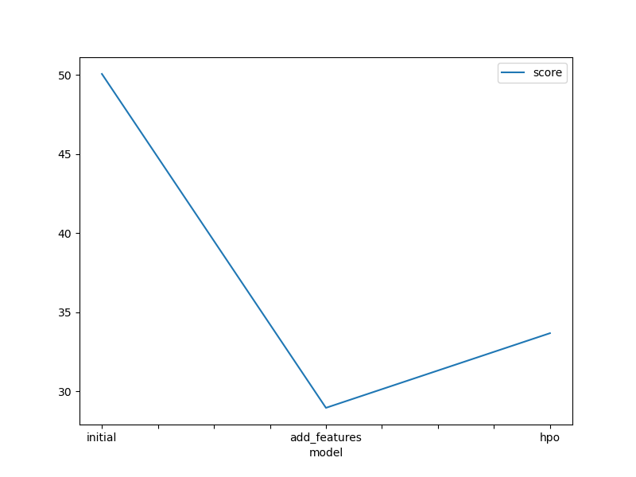
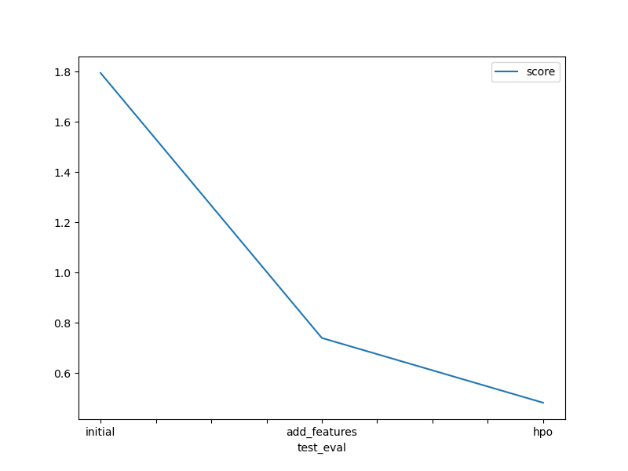

# Report: Predict Bike Sharing Demand with AutoGluon Solution
#### Roshan Sathyanarayana Shenoy

## Initial Training
### What did you realize when you tried to submit your predictions? What changes were needed to the output of the predictor to submit your results?
* Changes had to be made in order to eliminate the predictions less than zero, if there are any
* Adding the additional arguments for hyperparameter and hyperparameters needed to be checked by referring to autogluon documentation 

### What was the top ranked model that performed?
The top ranked model was WeightedEnsemble_L3 with hyperparameter tuning. The score was 0.47816

## Exploratory data analysis and feature creation
### What did the exploratory analysis find and how did you add additional features?
From the exploratory analysis the following observations were made 
* Data for datetime, temp and atemp was observed to be normally distributed,
* It seemed more logical to consider datetime for additional features, since the demand would actually depend on the day, hour, month and year, also considering the seasons into account 
* Data for other features were either positively or negatively skewed 

### How much better did your model preform after adding additional features and why do you think that is?
After adding additional features from datetime for day, hour, month and year, the model performed better by 58.8% .This is due to better feature engineering as it led to the consideration of more information that was previously not explicitly available in the dataset 

## Hyper parameter tuning
### How much better did your model preform after trying different hyper parameters?
Only dropout probability, no.of epochs and no.of boot rounds were considered for hyperparameter tuning study. The test score decreased from 0.73999 to 0.48241, However it led to an increase in the validation score from 28.959252 to 33.679892. 

### If you were given more time with this dataset, where do you think you would spend more time?
I would invest my time more on feature engineering, to explore what other features could have a significant contribution to the prediction score.

### Create a table with the models you ran, the hyperparameters modified, and the kaggle score.
|model|hpo1|hpo2|hpo3|score|
|--|--|--|--|--|
|initial|default_vals|default_vals|default_vals|1.79437|
|add_features|default_vals|default_vals|default_vals|0.73999|
|hpo|NN: num_epochs: 10|NN: dropout_prob: ag.space.Real(0.0, 0.5, default=0.1)|GBM: num_boost_round: 100|0.48241|

### Create a line plot showing the top model score for the three (or more) training runs during the project.

### Create a line plot showing the top kaggle score for the three (or more) prediction submissions during the project.

## Summary
* Adding additional features led to a better test and validation score 
* Tuning the hyperparameters led to a better test score but the validation score increased   
* For emphasis to be has to be laid on better feature engineering in order to further optimize the test and validation scores.

## References
* AutoGluon Documentation https://auto.gluon.ai/dev/_modules/autogluon/tabular/predictor/predictor.html#TabularPredictor.fit
* Amazon SageMaker Examples https://sagemaker-examples-test-website.readthedocs.io/en/latest/advanced_functionality/autogluon-tabular/AutoGluon_Tabular_SageMaker.html#Hyperparameter-Selection
* Predicting Columns in a Table - In Depth. AutoGluon. https://auto.gluon.ai/0.0.15/tutorials/tabular_prediction/tabular-indepth.html